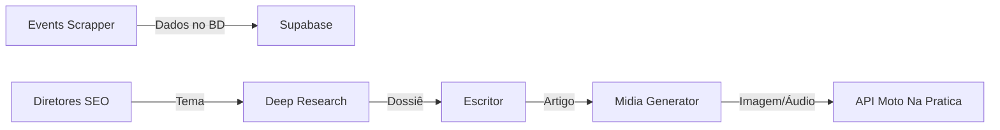

# 🏗️ Arquitetura - Moto Na Pratica

> Documentação técnica da arquitetura de automação

## Visão Geral

O sistema utiliza uma arquitetura de **micro-workflows** que se comunicam via Tool Calls, permitindo:

- Separação de responsabilidades claras
- Reutilização de componentes
- Escalabilidade independente
- Manutenção simplificada

## 🔄 Fluxo de Dados

## 📊 Componentes

### 1. Data Layer
- **Supabase** - Banco de dados PostgreSQL
- Tabelas: eventos, resultados, posts, deep_research

### 2. Orchestration Layer
- **n8n** - Motor de automação
- **MCP Tools** - Integração via Model Context Protocol

### 3. AI Layer
- **Vertex AI** - Geração de imagens e análise
- **OpenRouter** - Modelos OpenAI
- **Google TTS** - Narração em português

### 4. Integration Layer
- **Apify** - Web scraping
- **Jina AI** - Extração de conteúdo
- **SerpAPI** - Google Trends e Search

## 🔐 Segurança

### API Keys (via n8n Credentials)

| Serviço | Tipo | Uso |
|---------|------|-----|
| Google Service Account | OAuth2 | Vertex AI, TTS, Storage |
| OpenRouter | API Key | Modelos de chat |
| SerpAPI | API Key | Google Trends/Search |
| Supabase | JWT | Banco de dados |

## 📈 Escalabilidade

Cada workflow pode ser:
- Executado isoladamente
- Replicado para load balancing
- Monitorado individualmente

---

[← Voltar](/README.md)
